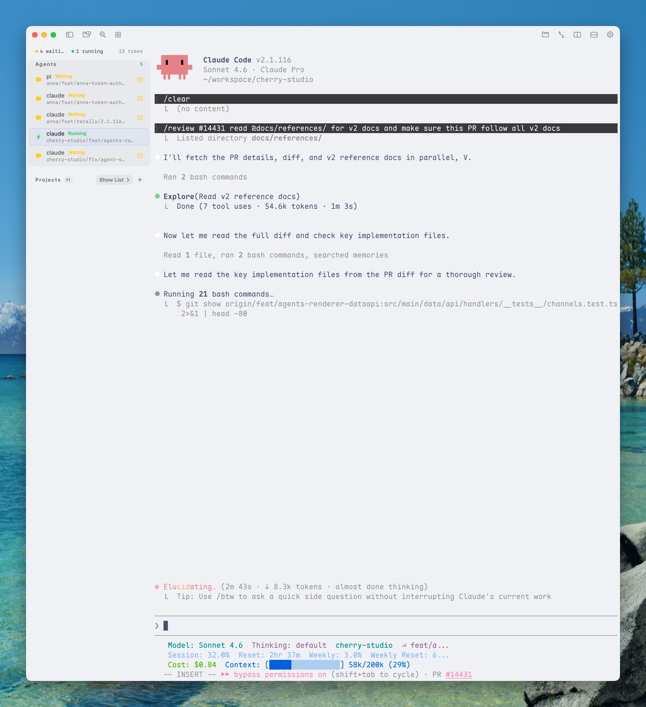
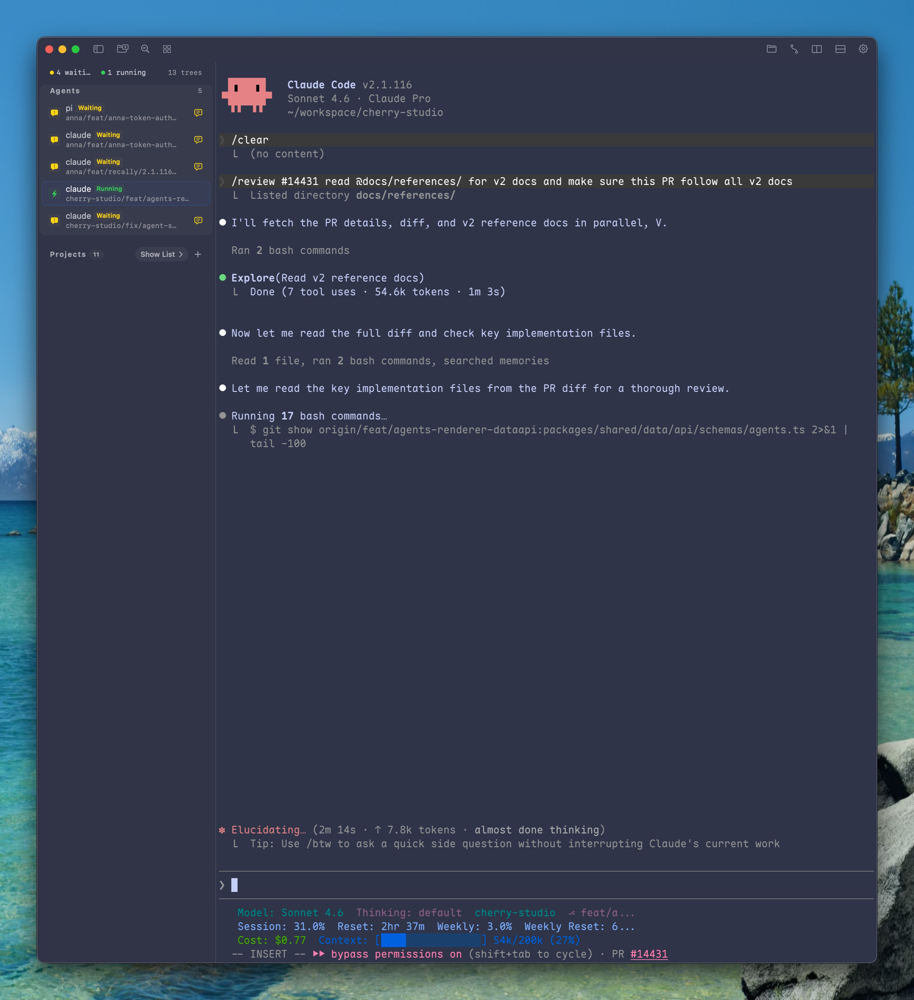
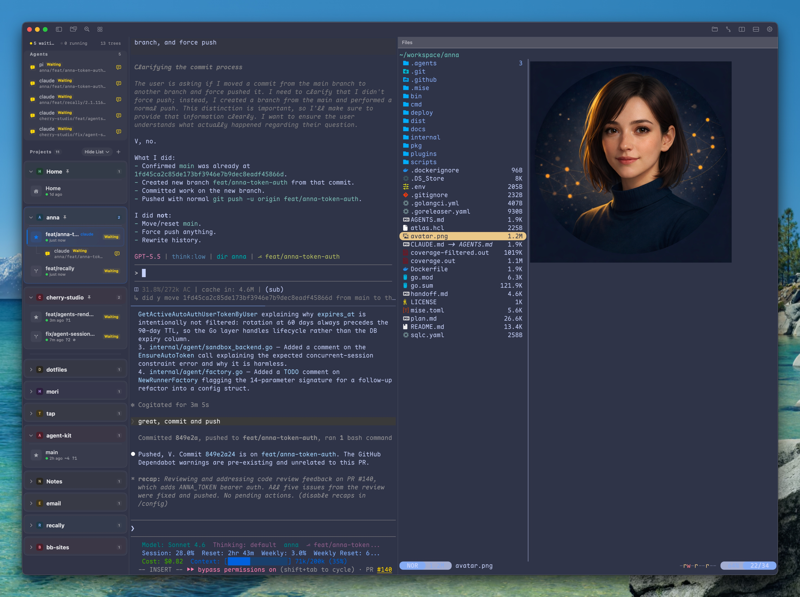
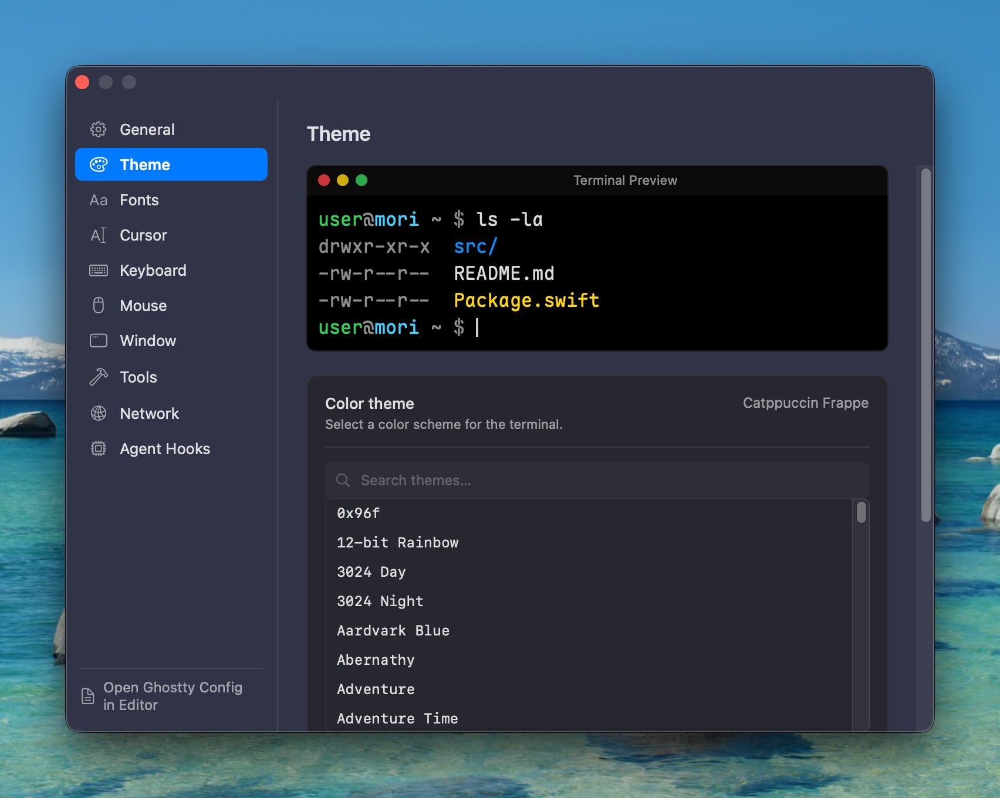

<p align="center">
  
</p>

<p align="center">
  <b>English</b> | <a href="README.zh-Hans.md">中文</a>
</p>

Mori is a macOS terminal built for developers who work across multiple git branches at the same time. Instead of juggling anonymous tabs or losing tmux state between context switches, Mori gives each branch its own persistent environment — and keeps them all one click away in a sidebar.

## Screenshots

| Light | Dark | Lazygit | Yazi | Settings |
|---|---|---|---|---|
|  |  |  |  |  |

## Features

- **One sidebar, every branch** — your projects and worktrees are always one click away; no anonymous tabs to lose track of
- **Sessions that outlive the app** — close Mori, reopen it tomorrow; tmux keeps every process running exactly where you left it
- **True branch isolation** — each worktree gets its own directory and tmux session; run `main` and `feat/auth` side-by-side without interference
- **Local + SSH** — connect local repos or remote servers; the native Mac UI works either way
- **GPU-rendered terminal** — Ghostty's libghostty engine with Metal acceleration
- **Terminal drag-and-drop** — drop files, URLs, or text to insert shell-ready paths and content
- **CLI + agent-ready** — `mori` CLI exposes everything over a Unix socket; built for scripting and AI agent workflows
- **MoriRemote** — iPhone/iPad companion for SSH/tmux access when away from your Mac

## The mental model

Mori maps your development hierarchy onto tmux. Each git worktree becomes a tmux session; each session holds windows (tabs) and panes (splits). Close the app, come back tomorrow — everything is still running.

```
Project  (git repo)
└── Worktree  (branch)          ← tmux session  e.g. myapp/feat-auth
    ├── Window  (tab)           ← tmux window   e.g. "shell"
    │   ├── Pane  (split left)  ← tmux pane
    │   └── Pane  (split right) ← tmux pane
    └── Window  (tab)           ← tmux window   e.g. "logs"
        └── Pane
```

- **Project** — a git repository tracked by root path and short name.
- **Worktree** — a `git worktree` checkout; gets its own directory and tmux session (`<project>/<branch>`).
- **Window** — a tmux window inside the session. Equivalent to a tab.
- **Pane** — a tmux pane inside a window. Equivalent to a split.

The sidebar lists your projects and worktrees. Click one to attach. Switching is instant — you never lose what was running.

## Install

```bash
brew tap vaayne/tap
brew install --cask mori
```

Or download from [GitHub Releases](https://github.com/vaayne/mori/releases). MoriRemote for iOS is on [TestFlight](https://testflight.apple.com/join/k2GFJPC2).

<details>
<summary>Build from source</summary>

Requires macOS 14+, tmux, [mise](https://mise.jdx.dev/), Zig 0.15.2, and Xcode.

```bash
mise run build    # Debug build (bootstraps libghostty automatically)
mise run dev      # Build + run
mise run test     # Run all tests
```
</details>

## CLI

The `mori` CLI communicates with the running app over a Unix socket, auto-launching Mori if needed. Address flags default to `MORI_*` environment variables set in every pane — inside a session you can omit them entirely.

```bash
mori project open .                          # register current directory as a project
mori worktree new feat/auth --project myapp  # create git worktree + tmux session
mori pane read --lines 100                   # capture pane output (great for agents)
mori focus --project myapp --worktree feat/auth  # switch to a worktree instantly
```

All commands accept `--json` for machine-readable output. See [docs/cli-redesign.md](docs/cli-redesign.md) for the full reference.

## Terminal Configuration

Mori uses Ghostty's configuration system. Customize your terminal in `~/.config/ghostty/config`. Mori only overrides a few embedding-specific settings (no window decorations, no quit-on-last-window).

For Mori-managed tmux sessions, Mori also applies a small tmux preset by default to speed up onboarding: mouse support on, status bar off. You can turn that off in **Settings → Tools** if you prefer to keep your own mouse and status-bar behavior from `tmux.conf` instead.

## Keyboard Shortcuts

See [docs/keymaps.md](docs/keymaps.md) for the full list. Key highlights:

| Shortcut | Action |
|---|---|
| <kbd>⌘</kbd>+<kbd>T</kbd> | New window (tab) |
| <kbd>⌘</kbd>+<kbd>D</kbd> / <kbd>⌘</kbd>+<kbd>⇧</kbd>+<kbd>D</kbd> | Split right / down |
| <kbd>⌃</kbd>+<kbd>Tab</kbd> | Cycle worktrees |
| <kbd>⌘</kbd>+<kbd>⇧</kbd>+<kbd>N</kbd> | New worktree |
| <kbd>⌘</kbd>+<kbd>⇧</kbd>+<kbd>P</kbd> | Command palette |
| <kbd>⌘</kbd>+<kbd>G</kbd> | Lazygit |
| <kbd>⌘</kbd>+<kbd>E</kbd> | Yazi |

## License

[MIT](LICENSE)
